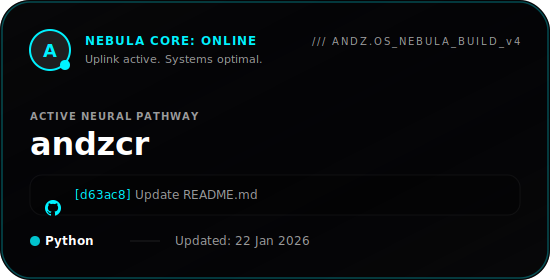

#  A N D Z / / S T U D I O

Hi! My name is [**Andrei**](https://andzcr.github.io), and I enjoy creating clean, intuitive, and visually engaging user experiences. I'm a serious and detail-oriented person who doesn't give up until I achieve the result I want. Constant growth is important to me, and I'm continuously working on both my personal and professional development. I'm always eager to learn new technologies, take on challenges, and refine my skills to become a better version of myself.

---

###  Here are the tools, libraries, technologies, and frameworks I've worked with:

  
  
  
  
  
  
  
  
  
  

---

###  Connect with me // I usually respond within 24 hours.

&nbsp; &nbsp; &nbsp; &nbsp; 

  

